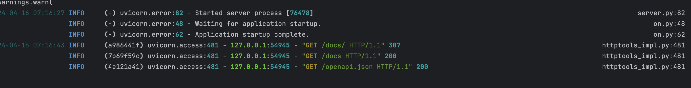

# FastApi Skeleton
This application provides the basic structure for FastAPI development, implementing features such as logging, authentication, and containerization. 

While this skeleton is concentrated on the BrainyPedia project, it can be used in any other project.
## Features Implemented
- [x] Logging 
- 
## Features to be Implemented
- [ ] Containerization of the application
- [ ] JWT-based Authentication
- [ ] E-mail confirmation for new JWT-user


### Environment variables
```bash
ENV_STATE=dev 
DATABASE_URL= 
DB_FORCE_ROLL_BACK=False
LOGTAIL_API_KEY= 
JWT_POSTGRES_DATABASE_PORT= 
JWT_POSTGRES_DATABASE_USER= 
JWT_POSTGRES_DATABASE_PASSWORD= 
JWT_POSTGRES_TABLE_USER_SCOPE_REL= 
JWT_POSTGRES_DATABASE_NAME= 
JWT_POSTGRES_TABLE= 
JWT_POSTGRES_DATABASE_HOST_URL= 
JWT_POSTGRES_TABLE_USER= 
JWT_POSTGRES_TABLE_SCOPE= 
JWT_ALGORITHM= 
JWT_SECRET_KEY= 
```


### Acknowledgements
Special thanks to the authors of the resources below who helped with some best practices.
- Building Python Microservices with FastAPI
- Mastering-REST-APIs-with-FastAPI
- FastAPI official documentation

### License
[MIT](https://github.com/git/git-scm.com/blob/main/MIT-LICENSE.txt)